# Mileage Tracker 

**Autor**: Yashwanth Gajji

## About

An application that allows users to track enter and track their vehicle refuelling data and see mileage performance of their vehicles. Dynamic visualization of mileage performance and money spent on refuelling the vehicle can be seen.

### Features
- User can sign up into application, see his profile on sign in page and login using 4 digit passcode.
- User can add, edit and delete vehicle details. User can choose a picture for the vehicle and view all vehicles in Vehicles tab.
- User can add, edit refuelling data for each vehicle and can be viewed in Refuelling tab.
- User can see dynamic visualization of monthly mileage performance and money spent monthly and total average mileage and last mileage.
- All data is stored in Async Storage (local storage).
- Zustand is used for Global State Management.

### Technologies Used
- React Native
- Expo
- NativeWind
- AysncStorage
- Zustand

### Other Libraries Used
- react-native-chart-kit
- expo-image-picker
- @react-native-async-storage/async-storage
- zustand
- react-native-otp-textinput
- react-native-dropdown-select-list

## Geting started

1. Download the Zip or  Clone the repository.

2. Install dependencies
   ```bash
   npm install
   ```
3. Run the Application
   ```bash
    npx expo start
   ```

In the output, you'll find options to open the app in a
- [Expo Go](https://expo.dev/go), Easy and Preferable way
- [Android emulator](https://docs.expo.dev/workflow/android-studio-emulator/)
- [iOS simulator](https://docs.expo.dev/workflow/ios-simulator/)

## Demo

## Screenshots
### Authentication Screens
&emsp;&emsp;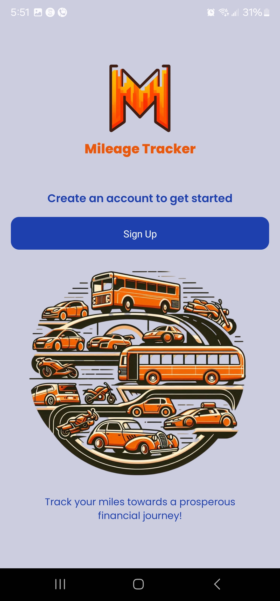&emsp;&emsp;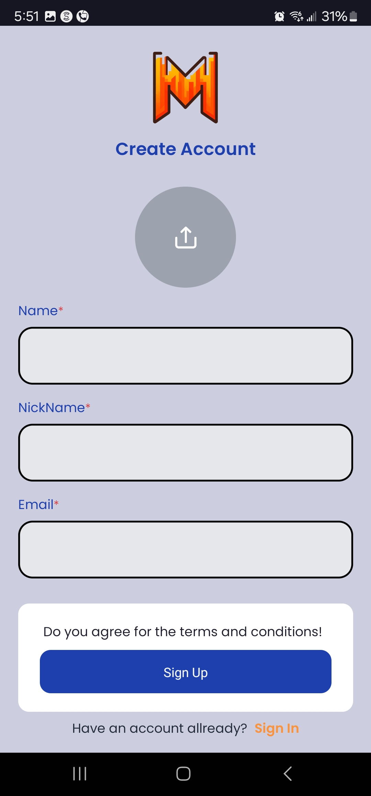

&emsp;&emsp;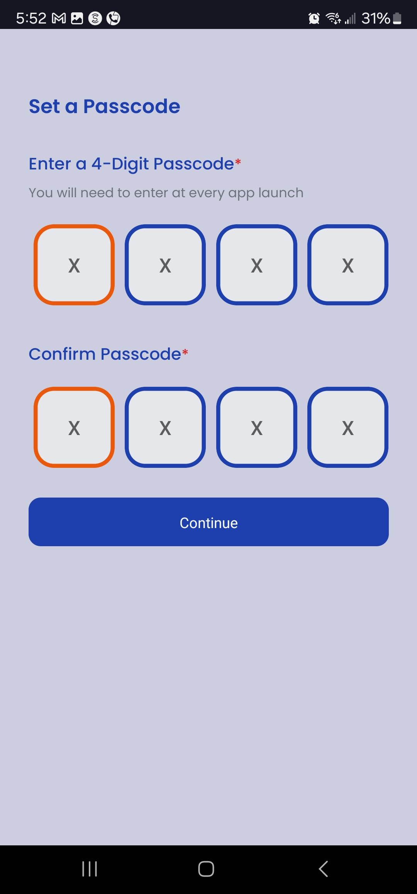&emsp;&emsp;

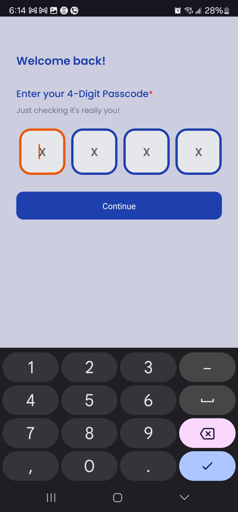

### Home Screeens
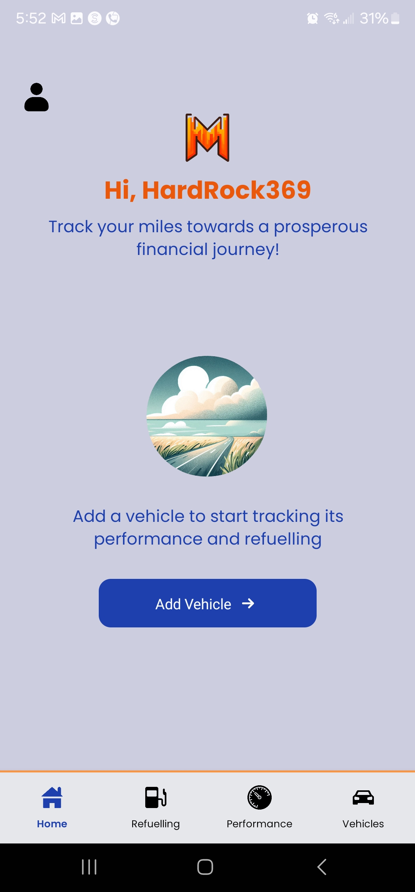&emsp;&emsp;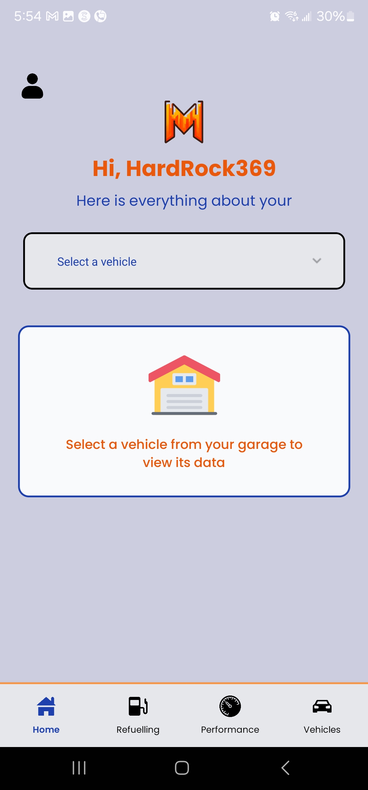


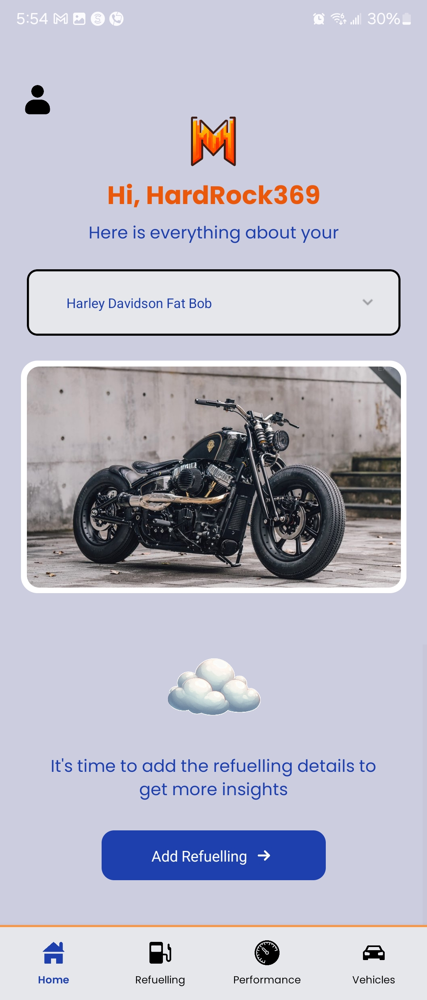&emsp;&emsp;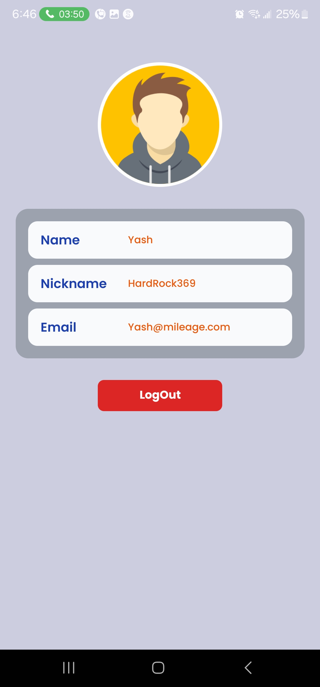&emsp;&emsp;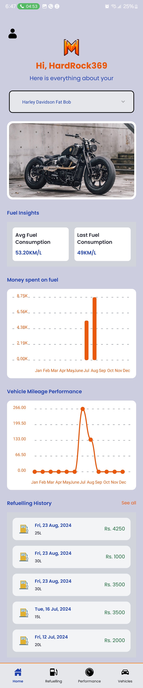

### Refuel and Performance Screens
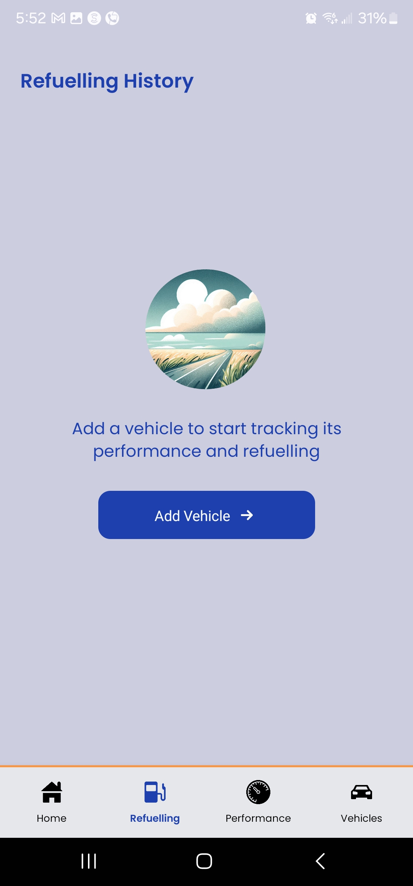&emsp;&emsp;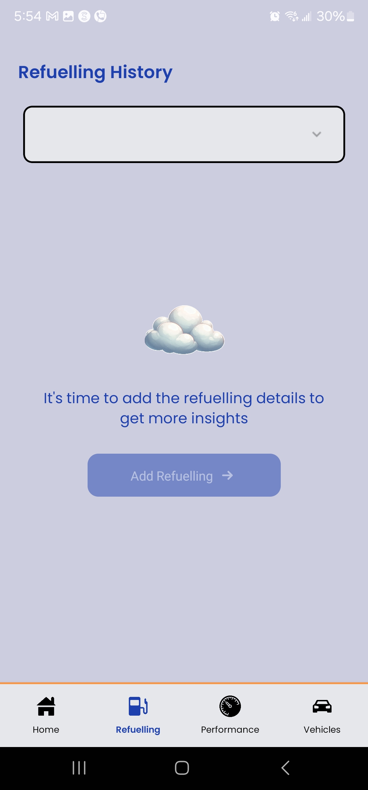&emsp;&emsp;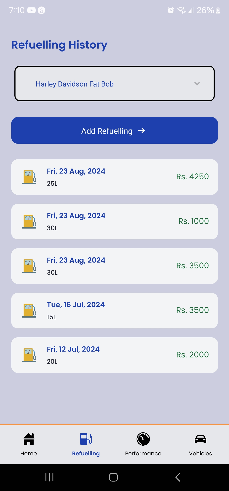

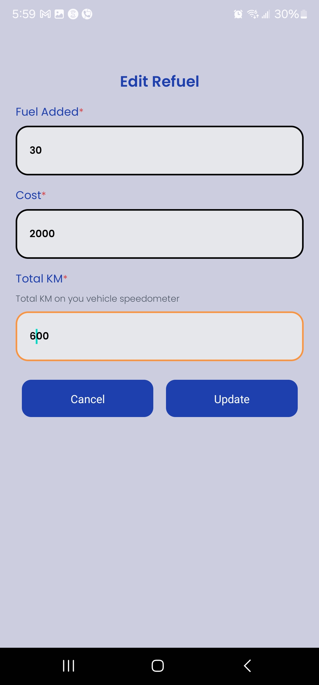&emsp;&emsp;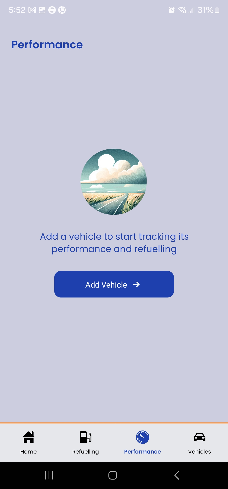&emsp;&emsp;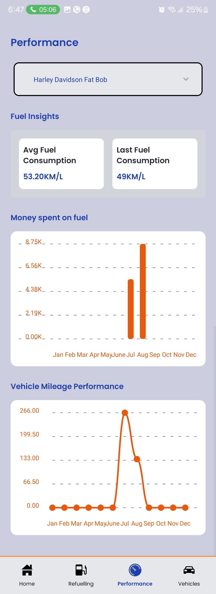

### Vehicle Screens
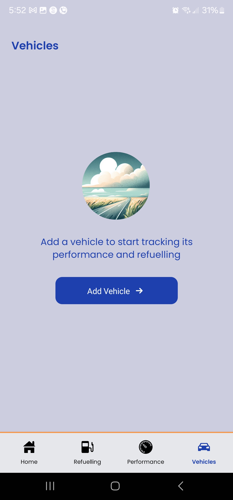&emsp;&emsp;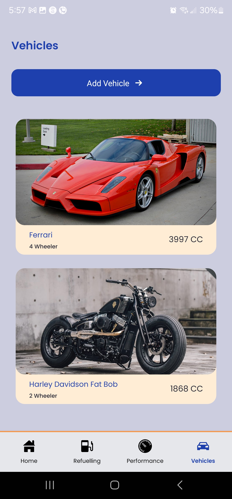&emsp;&emsp;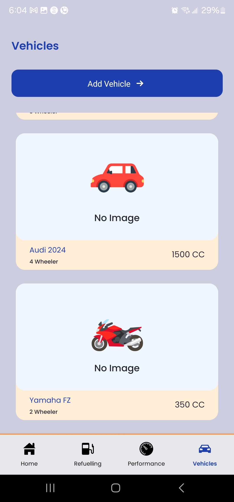

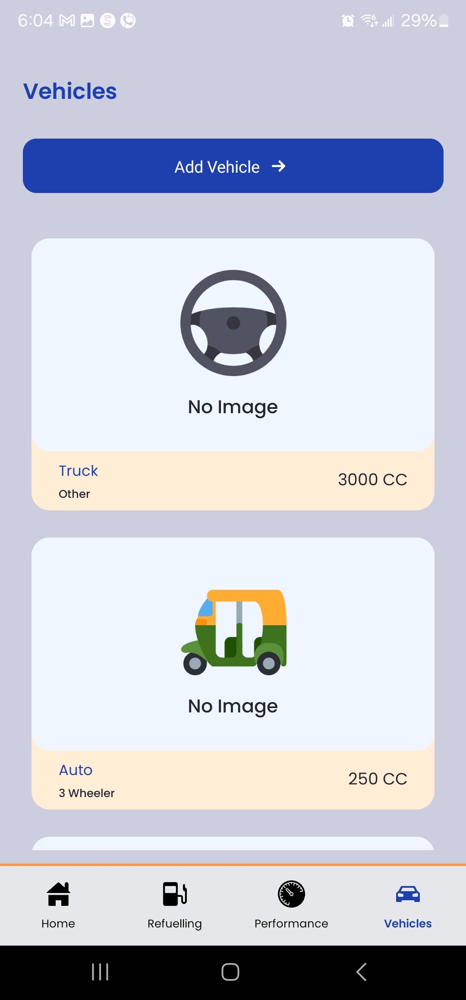&emsp;&emsp;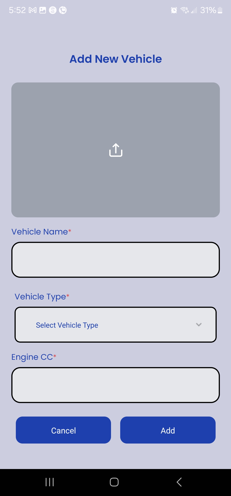&emsp;&emsp;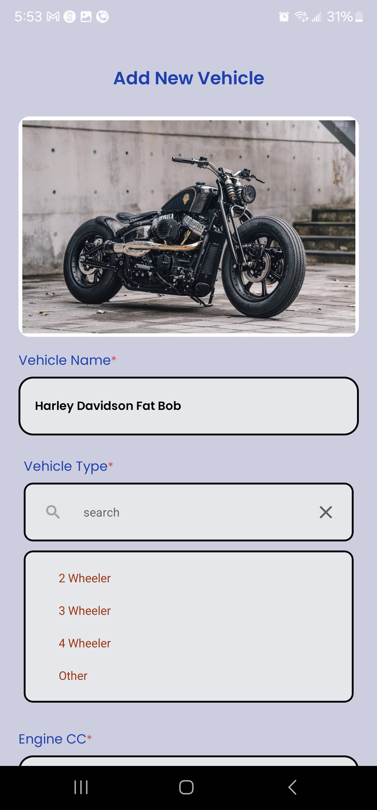

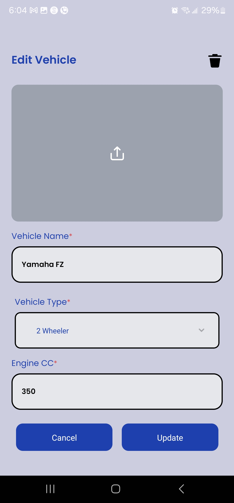&emsp;&emsp;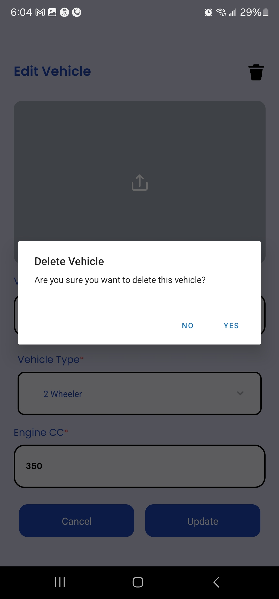
